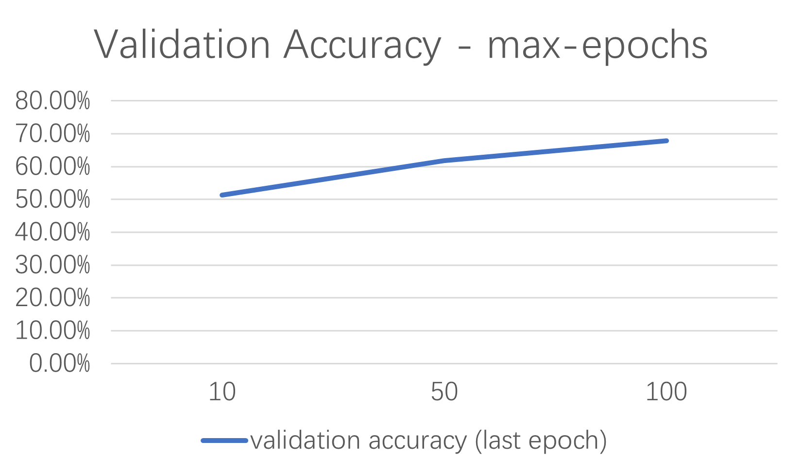
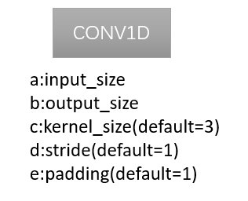
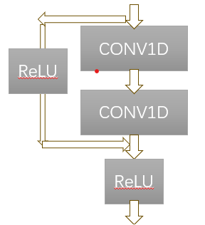
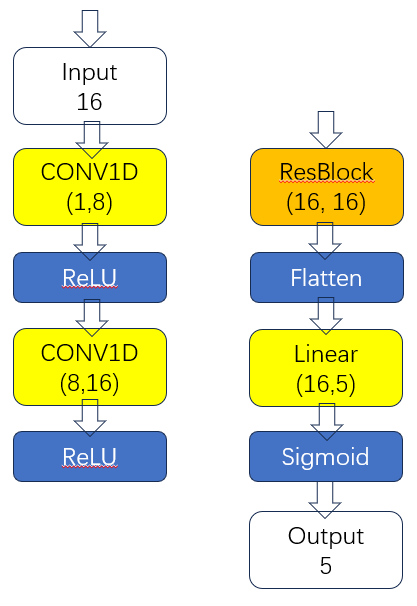

# Lab1

## Varying Parameters
 We have trained the following 12 models with specific parameters (batch size, maximum number of epochs, learning rate, etc.) for training and validation.
 
|           | max-epoch | learning-rate | batch-size |val_acc_last_epoch|
|-----------|-----------|---------------|------------|------------------|
| model1    | 10        | 1e-5          | 256        |      0.513       |
| model2    | 50        | 1e-5          | 256        |      0.618       |
| model3    | 100       | 1e-5          | 256        |      0.678       |
| model4    | 10        | 1e-5          | 16         |      0.569       |
| model5    | 10        | 1e-5          | 32         |      0.572       |
| model6    | 10        | 1e-5          | 64         |      0.550       |
| model7    | 10        | 1e-5          | 128        |      0.531       |
| model8    | 10        | 1e-5          | 512        |      0.471       |
| model9    | 10        | 1e-6          | 256        |      0.513       |
| model10   | 10        | 1e-4          | 256        |      0.680       |
| model11   | 10        | 1e-3          | 256        |      0.713       |
| model12   | 10        | 1e-2          | 256        |      0.573       |

For each model with specific configuration, we conducted 10 training iterations, each capped at a predefined number of epochs. （To clarify, if each training iteration lasts for 50 epochs, and we conducted 10 separate training iterations, it amounted to a total of 500 epochs across all iterations.)__ 

Finally, we calculated the average validation accuracy using the values obtained at the final epoch of each independent training iteration, and this is represented by "**val_acc_last_epoch**".

### Impact of varying batch sizes

After conducting experiments with batch sizes of 16, 32, 64, 128, 256, and 512, we have derived the following insights:     

Our obeservations indicate that an increase in batch size correlates with a decrease in validation accuracy. This phenomenon can be attributed to the fact that larger batch sizes provide a more comprehensive representation of the training dataset, leading to higher training accuracy. However, this comprehensive representation would normally have much higher training accuracy, which subsequently facilitate convergence towards local minima (as weight updates become less frequent).

Conversely, smaller batch sizes provide gradient estimates with higher variance, which is beneficial in that it enables the model to avoid the local minima, guiding it towards more optimal solutions that are closer to the global minima. In our experiments, generally speaking, smaller batch size resulted in improved validation accuracy due to the more frequent and varied weight updates.

Nonetheless, it is important to note that excessively small batch sizes can introduce an excessive amount of noise into the gradient estimates, which leads to instability during training and therefore, degraded model performance. (In our case, when batch size is only 16, the validation accuracy dropped from 57.2% to 56.9%).

Besides the impact on validation accuracy, we've also found that smaller batch sizes could lead to better generalization ability. See the table below for comparison: 
|           | batch-size |val_acc_last_epoch|train_acc_last_step|
|-----------|------------|------------------|-------------------|
| model4    | 16         |      0.569       |       0.487       |
| model5    | 32         |      0.572       |       0.500       |
| model6    | 64         |      0.550       |       0.500       |
| model7    | 128        |      0.531       |       0.588       |
| model1    | 256        |      0.513       |       0.561       |
| model8    | 512        |      0.471       |       0.487       |   

Here, we use "**train_acc_last_step**" to represent the accuracy of the last training step. (This metric is not particularly accurate due to its randomness, but it could be representative).

It has been observed that larger batch sizes typically yield higher training accuracy compared to validation accuracy. Conversely, this trend tends to invert with the reduction of batch sizes, which means better generalization ability.

### Impact of varying max epochs

We found that larger total epochs of training result in the model's overall better performance, as more training would capture more patterns of the data. Meanwhile, as the model **JSC-Tiny** used is a simple model with only one linear layer and the dataset is big enough, the overfitting problem did not occur ith more training epochs, as can be observed from the table below:
|           |  max-epoch |val_acc_last_epoch|train_acc_last_step|
|-----------|------------|------------------|-------------------|
| model1    | 10         |      0.513       |       0.561       |
| model2    | 50         |      0.618       |       0.678       |
| model3    | 100        |      0.678       |       0.714       |

In our case, both the validation accuracy and the training accuracy increased with more epochs.

### What is happening with a large learning rate and what is happening with a small learning rate and why? What is the relationship between learning rates and batch sizes?

With larger learning rate, there's rapid convergence to a solution, and it has the potential to escape the local minima with large step. However, the solution might not be the optimal one (global minima), it mgith instead diverge from the minima point. Moreover, oscillation might occur near optimal points.

With lower learning rate, there's slow convergence due to small steps, and the model might fall into local minima, especially when the batch size is also large.

|           | leanring-rate |val_acc_last_epoch|train_acc_last_step|
|-----------|---------------|------------------|-------------------|
| model9    | 1e-6          |      0.513       |       0.561       |
| model1    | 1e-5          |      0.513       |       0.561       |
| model10   | 1e-4          |      0.680       |       0.643       |
| model11   | 1e-3          |      0.713       |       0.694       |
| model12   | 1e-2          |      0.573       |       0.597       |

In our experiments, the validation accuracy increases from 1e-6 to 1e-3, before falling back to 57.3% at 1e-2. 

**Realtionship between learning rates and batch sizes**:  

Both hyperparameters have impact on the speed of convergence accroding to the formula: 

Therefore, when batch size is large (indicating smaller gradiant of loss to weights), we usually choose larger learning rate. Vice versa.

## Train your own network

We've implemented a network with the following architecture:

**Legend**:

  <figure style="margin-right: 20px;">
    
  </figure>
  <figure>
    
  </figure>

<pre>Conv1D Illustration               Residual Block Diagram   </pre>

**Network Architecture**

The network begins with an input of size 16 and features a residual block after two initial 1D convolutional and ReLU layers, the parallel paths of residual block then converge to a linear layer, and finally produces a final output of size 5 after a sigmoid activation function.

**Parameters**
<pre>
jsc_rs1923 = JSC_rs1923(info)
total_params = 0
for param in jsc_rs1923.parameters():
    total_params += param.numel()
print(f'Total number of JSC_rs1923 parameters: {total_params}')
 # same for jsc_tiny
</pre>
And we get the parameters of jsc_rs1923 to be 3285, compared to that of JSC-Tiny (117).

**Performance**

Note that in order to train the modified network, we first need to modify the dataset as follows:
<pre>
# ./chop/dataset/physical/jsc.py  Line 164
def __getitem__(self,idx):
   x = self.X[idx]
   y = self.Y[idx]
   x = x.unsqueeze(0)  # used only for the convolution model JSC_rs1923
   return x,y
# This adds an extra dimension to the input data, changing it from 16 to 1x16.
</pre>

We've trained for 10 epochs and derived the validation accuracy of the last epoch at **65.1%**, which is higher than that of JSC-tiny at **51.3%**.
<pre>
Epoch 9: 100% 3084/3084 [00:33<00:00, 91.36it/s, v_num=2, train_acc_step=0.643, val_acc_epoch=0.651, val_loss_epoch=1.020]
INFO     Training is completed
</pre>

In conclusion, by incorporating 1D convolutional layers and residual modules, we have enabled the network to learn deeper-level features, thus achieving better overall performance.

# Lab2

## Explain the functionality of report_graph_analysis_pass and its printed jargons such as placeholder, get_attr ... 

The **report_graph_analysis_pass** function provides a high-level abstraction of the model's architecture. By utilizing the torch.fx module's capabilities[1], it categorizes the model's various components into distinct types, and enumerate each component along with its respective parameters. 

Furthermore, though no transform performed at the moment, this function offers strategic insights into potential model transformation methodologies for optimization.

[1]: The function mainly iterates nodes in graph.fx_graph, and graph.fx_graph is defined in:
<pre>
# ./chop/ir/graph/mase_graph.py
self.model = fx.GraphModule(model, self.tracer.trace(model, cf_args))
''''''
def fx_graph(self):
       return self.model.graph
# Therefore, **report_graph_analysis_pass** utilizes torch.fx's graph to depict the model.
</pre>

