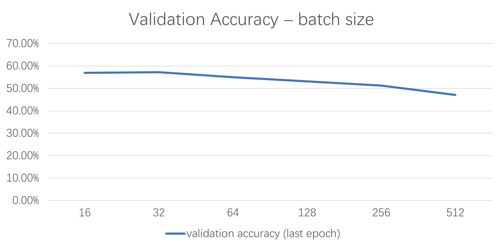

# Varying Parameters

|           | max-epoch | learning-rate | batch-size |val_acc_last_epoch|
|-----------|-----------|---------------|------------|------------------|
| model1    | 10        | 1e-5          | 256        |      0.513       |
| model2    | 50        | 1e-5          | 256        |      0.618       |
| model3    | 100       | 1e-5          | 256        |      0.678       |
| model4    | 10        | 1e-5          | 64         |      0.550       |
| model5    | 10        | 1e-5          | 128        |      0.531       |
| model6    | 10        | 1e-5          | 512        |      0.471       |
| model7    | 10        | 1e-6          | 256        |      0.513       |
| model8    | 10        | 1e-4          | 256        |      0.680       |
| model9    | 10        | 1e-3          | 256        |      0.713       |
| model10   | 10        | 1e-2          | 256        |      0.573       |

For each model with specific parameters (batch size, maximum number of epochs, learning rate, etc.), we conducted 10 training iterations, each capped at a predefined number of epochs. （To clarify, if each training iteration lasts for 10 epochs, and we conducted 10 separate training iterations, it amounted to a total of 100 epochs across all iterations.) 

Finally, we calculated the average validation accuracy using the values obtained at the final epoch of each independent training iteration, and this is represented by "**val_acc_last_epoch**".

## Impact of varying batch sizes

## Impact of varying max epochs

