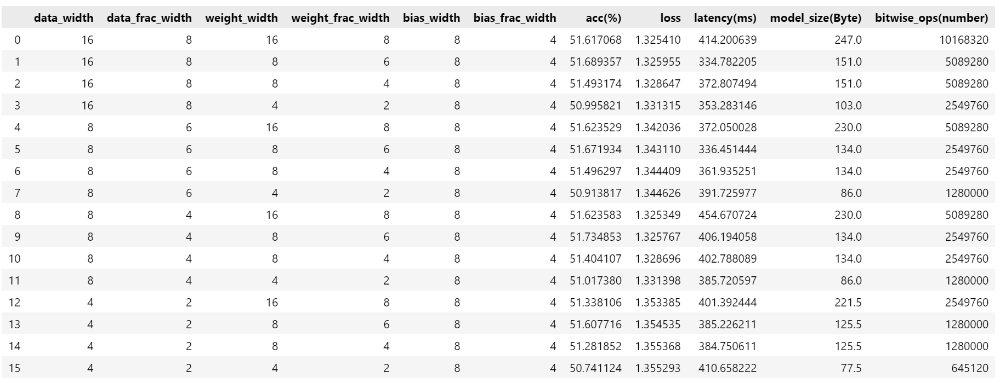
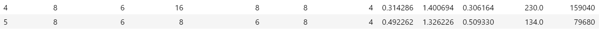
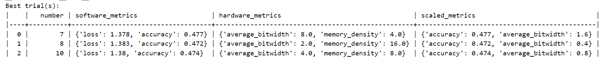

# Lab 3

## 1. Explore additional metrics that can serve as quality metrics for the search process. 

Overall, we have explored four additional metrics: Latency, Model size, FLOPs, and Bit-wise operations.

**Latency**: (Unit: ms, we have multiplied by 1000)

For each search option, we calculate the latency for each input-batch, then accumulate all latencies to take the average.
<pre>
for i, config in enumerate(search_spaces):
    mg, _ = quantize_transform_pass(mg, config)
    ''''''
    for inputs in data_module.train_dataloader():
        xs, ys = inputs
        start_time = time.time() # start time
        preds = mg.model(xs)
        end_time = time.time() # end time
        latency = end_time - start_time # latency
        latencies.append(latency*1000)
        ''''''
    latency_avg = sum(latencies) / len(latencies) 
</pre>

**Model size**: (Unit: Byte)

It is presupposed that the model, whose size is to be calculated, has already undergone quantization, each time with different search option.

For each search option, we calculate the total storage size of the model by iterating through the space occupied by the weights of each layer.
<pre>
The memory footprint of each layer is determined by the following attributes:
Linear: weight, bias
Batchnorm: weight(γ), bias(β), mean, variance
ReLU: None
</pre>

The subsequent script is designed for assessing the memory consumption attributed to the model
<pre>
def model_storage_size(model, weight_bit_width, bias_bit_width, data_bit_width):
    total_bits = 0 
    for name, param in model.named_parameters():
        if param.requires_grad and 'weight' in name:
            bits = param.numel() * weight_bit_width
            total_bits += bits
        elif param.requires_grad and 'bias' in name:
            bits = param.numel() * bias_bit_width
            total_bits += bits
    total_bits += data_bit_width*(1*16+1) # mean and variance of batchnorm
    total_bytes = total_bits / 8
    return total_bytes

for i, config in enumerate(search_spaces):
    # definition of weight & bias & data width
    size = model_storage_size(mg.model, weight_bit_width, bias_bit_width, data_bit_width)
    ''''''
</pre>

**FLOPs**: (Unit: number)

For each search option, we compute the FLOPs for linear, batchnorm, and relu module.

We employ the same methodology as outlined in the optional task of Lab2. 
(Detailed explanations are also available in the code comments)

<pre>
def calculate_flop_for_linear(module, batch_size):
    in_features = module.in_features
    out_features = module.out_features
    return batch_size*(in_features * out_features)
def calculate_flop_for_batchnorm1d(module, batch_size):
    num_features = module.num_features
    # calculate the mean: num_features * batch_size  [for each element, (batch_size-1)add, 1division]
    # calculate the variance: (2*num_features+(num_features-1))*batch_size + (batch_size-1)  [for each element:2, for each sample: 2*num_features+(num_features-1)]
    # calculate the denominator (knowing variance): 2  [add bias & square root]
    # calculate for each sample xi: 4*num_features  [for each element, 4: 1*minus, 1*division, 1*multiply, 1*add]
    return num_features * batch_size + (2*num_features+(num_features-1))*batch_size + (batch_size-1) + 2 + batch_size*(4*num_features)
def calculate_flop_for_relu(module, input_features, batch_size):
    # per element comparison with 0 (in essence, a minus)
    input_features = input_features*batch_size
    return input_features
def add_flops_bitops_analysis_pass(graph):
    total_flops = 0
    for node in graph.fx_graph.nodes:
        if isinstance(get_node_actual_target(node), torch.nn.modules.Linear):
            flops = calculate_flop_for_linear(get_node_actual_target(node), batch_size)
            total_flops += flops
        elif isinstance(get_node_actual_target(node), torch.nn.modules.BatchNorm1d):
            flops = calculate_flop_for_batchnorm1d(get_node_actual_target(node), batch_size)
            total_flops += flops
    flops = calculate_flop_for_relu(get_node_actual_target(node), 16, batch_size)
    total_flops += flops
    flops = calculate_flop_for_relu(get_node_actual_target(node), 5, batch_size)
    total_flops += flops
    return total_flops
</pre>

**Bit-wise operations**: (Unit: number)

For each search option, we compute the bitwise operations count for linear module。

We employ identical methodology as outlined in the optional task of Lab2.

<pre>
def bit_wise_op(model, input_res, data_width, weight_width, bias_width, batch_size):
    total_bitwise_ops = 0
    for name, module in model.named_modules():
        if isinstance(module, LinearInteger):
            bitwise_ops = calculate_bitwise_ops_for_linear(module, input_res, data_width, weight_width, bias_width, batch_size)
            total_bitwise_ops += bitwise_ops
    return total_bitwise_ops
def calculate_bitwise_ops_for_linear(module, input_res, data_bit_width, weight_bit_width, bias_bit_width, batch_size):
    in_features = module.in_features
    out_features = module.out_features
    bitwise_ops_per_multiplication = data_bit_width * weight_bit_width
    bitwise_ops_per_addition = data_bit_width * weight_bit_width
    bitwise_ops_per_output_feature = in_features * bitwise_ops_per_multiplication + (in_features - 1) * bitwise_ops_per_addition
    if module.bias is not None:
        bitwise_ops_per_output_feature += bias_bit_width
    total_bitwise_ops = out_features * bitwise_ops_per_output_feature
    return total_bitwise_ops*batch_size

for i, config in enumerate(search_spaces):
    # definition of weight & bias & data width
    bit_op = bit_wise_op(mg.model, (16,), data_bit_width, weight_bit_width, bias_bit_width)
    ''''''
</pre>

## 2. Implement some of these additional metrics and attempt to combine them with the accuracy or loss quality metric

Note that to leverage the pretrained model (as relying solely on randomly initialized parameters across various models during the search process would make metrics like accuracy become meaningless), it is imperative to preload the "best.ckpt" file.
<pre>
CHECKPOINT_PATH = "/mnt/d/imperial/second_term/adls/new/mase/mase_output/jsc-tiny_classification_jsc_2024-02-05/software/training_ckpts/best.ckpt"
# model definition
model = load_model(load_name=CHECKPOINT_PATH, load_type="pl", model=model)
</pre>

Subsequently, inference is performed for each configuration within the search space.
<pre>
# Essential Code Segment (Extraneous elements omitted)
for i, config in enumerate(search_spaces):
    size = model_storage_size(mg.model, weight_bit_width, bias_bit_width, data_bit_width)  # model size after it has been quantized
    bit_op = bit_wise_op(mg.model, (16,), weight_bit_width, bias_bit_width, data_bit_width, batch_size)

    acc_avg, loss_avg = 0, 0;  accs, losses, latencies = [], [], []

    for inputs in data_module.train_dataloader():
        xs, ys = inputs
        start_time = time.time()
        preds = mg.model(xs)
        end_time = time.time()
        latency = end_time - start_time
        latencies.append(latency)

        acc = metric(preds, ys); accs.append(acc)
        loss = torch.nn.functional.cross_entropy(preds, ys); losses.append(loss)

    acc_avg = sum(accs) / len(accs)
    loss_avg = sum(losses) / len(losses)
    latency_avg = sum(latencies) / len(latencies) 

    # for this particular element in search space
    recorded_metrics.append({
        ......
    })   
</pre>

The figure above depicts the distinct metrics observed for varying quantization configurations, from which we could derive two main conclusions:

(Remember for the original model without quantisation, the validation accuracy is 51.30%).

1）Evidently, Post-Training Quantization (PTQ) does not compromise validation accuracy while markedly diminishing the storage requirements for data, weights, and biases. Hence, quantization proves to be beneficial.

2) Generally speaking, as the quantization precision of data, weights, and biases increases (i.e., higher retained precision), the performance of the model improves, as can be shown by the increased accuracy and reduced loss (though not obvious in our case). However, this also impacts other metrics to a certain extent, such as a noticeable increase in the latency required to execute a single batch, an augmentation in model size, and a rise in the number of bitwise operations.

Accuracy and loss actually serve as the same quanlity metric. In fact, accuracy and loss are inversely proportional, implying that as the model's prediction accuracy increases, the prediction loss correspondingly decreases. This relationship is evident from the following formula for accuracy:

This formula quantifies the number of incorrect predictions within a batch. When we consider its negation, it also serves as a form of loss.

## 3. Implement the brute-force search as an additional search method within the system, this would be a new search strategy in MASE.

Currently, the system employs the TPE sampler from Optuna, which is a Bayesian optimization method.

Alternatively, the BruteForceSampler from Optuna can also be utilized for hyperparameter optimization.

<pre>
# optuna.py within search strategies
def sampler_map(self, name):
    ''''''
    case "brute-force":
        sampler = optuna.samplers.BruteForceSampler()
    return sampler
# jsc_toy_by_type.toml (actually this name should be changed to jsc_tiny_by_type.toml as it uses the JSC-Tiny model)
[search.strategy.setup]
''''''
sampler = "brute-force"
</pre>

Note that we also need to rewrite the new search space in .toml file.

Then we execute the command:
<pre>
!./ch search --config configs/examples/jsc_toy_by_type.toml --load /mnt/d/imperial/second_term/adls/new/mase/mase_output/jsc-tiny_classification_jsc_2024-02-05/software/training_ckpts/best.ckpt
</pre>

And we get:

The trials with the highest accuracy range from 47% to 48%, which is close to the 51.3% accuracy of the original model, indicating that the model significantly reduces storage space while largely maintaining accuracy.

## 4. Comparison between brute-force search and TPE based search regarding sample efficiency.

Sample efficiency refers to the capability of identifying optimal (or near-optimal) hyperparameters utilizing the minimal number of trials ("samples").

Therefore, in the context of evaluating different samplers, we assess their performance based on the accuracy of the best trial in relation to the number of trials conducted.

# Lab4 

## 1. Modify the network to have layers expanded to double sizes.

We will adjust the configuration of each linear layer by applying a channel multiplier factor of 2.

Regarding the ReLU activation layers, it is accurate that the nn.ReLU module from PyTorch does not require any parameters for its initialization. Therefore, we'll standardize all ReLU layers to nn.ReLU().

<pre>
def instantiate_relu(boolean):
    return nn.ReLU(inplace=boolean)
def redefine_relu_pass(graph, pass_args=None):
    pass_args_copy = copy.deepcopy(pass_args)
    main_config = pass_args_copy.pop('config')
    default = main_config.pop('default', None)
    if default is None:
        raise ValueError(f"default value must be provided.")
    i = 0
    for node in graph.fx_graph.nodes:
        i += 1
        config = main_config.get(node.name, default)['config']
        name = config.get("name", None)
        if name is not None:
            new_module = instantiate_relu(True)
            parent_name, name = get_parent_name(node.target)
            setattr(graph.modules[parent_name], name, new_module)
    return graph, {}
    
pass_config_linear = {
"by": "name",
"default": {"config": {"name": None}},
"seq_blocks_2": {
    "config": {
        "name": "output_only",
        "channel_multiplier": 2,
        }
"seq_blocks_4": {
    "config": {
        "name": "both",
        "channel_multiplier": 2,
        }
    },
"seq_blocks_6": {
    "config": {
        "name": "input_only",
        "channel_multiplier": 2,
        }
    },
}
pass_config_relu = {
"by": "name",
"default": {"config": {"name": None}},
"seq_blocks_3": {
    "config": {
        "name": "relu",
        }
    },
"seq_blocks_5": {
    "config": {
        "name": "relu",
        }
    },
}
</pre>

## 2. Use grid search to search for the best channel multiplier value.

To ascertain the most effective channel multiplier, we have established a search space designed for selecting the optimal channel multiplier.

<pre>
search_space = [1,2,3,4,5]
</pre>

**Training Process**: 

Contrary to the approach taken in Lab 3, where pretrained models were loaded, the various architecture modifications proposed for this experiment remain untrained. Therefore, it is imperative to subject these modified networks to a comprehensive training before we perform any search. Otherwise, proceeding directly to inference with the dataloader on these untrained models would result in evaluations that lack substantive value. 

We set max_epoch=10 and batch_size=512 for the dataloader.

<pre>
# Essential Code Segment
for multiplier in channel_multiplier:
    # get sampled_config
    # define pass_config_linear & pass_config_relu 
    mg, _ = redefine_linear_transform_pass(graph=mg, pass_args={"config": pass_config_linear})
    mg, _ = redefine_relu_pass(graph=mg, pass_args={"config": pass_config_relu})

    for epoch in range(max_epoch): # sampled_config
        for inputs in data_module.train_dataloader():
            xs, ys = inputs
            optimizer.zero_grad()
            preds = mg.model(xs)
            loss = torch.nn.functional.cross_entropy(preds, ys)  
            loss.backward()  
            optimizer.step() 

    # save model, initialize masegraph and optimizer again
</pre>

Subsequently, we executed the search procedure. Given the network's simplicity—indicating manageable model size and reasonable latency—we focused exclusively on two key performance metrics: **accuracy (acc) and loss**， for evaluation.
<pre>
for multiplier in channel_multiplier:
    # get sampled_config
    # define pass_config_linear & pass_config_relu 
    mg, _ = redefine_linear_transform_pass(graph=mg, pass_args={"config": pass_config_linear})
    mg, _ = redefine_relu_pass(graph=mg, pass_args={"config": pass_config_relu})

    mymodel = load_model(f"mase_output/4_2/model_with_multiplier_{multiplier}.ckpt", "pl", mg.model) # load pre-trained model

    acc_avg, loss_avg = 0, 0 ; accs, losses = [], []
    for inputs in data_module.train_dataloader():
        xs, ys = inputs
        preds = mymodel(xs)
        acc = metric(preds, ys)
        accs.append(acc)
        loss = torch.nn.functional.cross_entropy(preds, ys)
        losses.append(loss)
    
    acc_avg = sum(accs) / len(accs) ; loss_avg = sum(losses) / len(losses)
    recorded_accs.append({"acc":acc_avg,"loss":loss_avg})
</pre>

# 3. Search for Optimal Channel Multipliers with Independent Layer Scaling

To achieve individual scaling of each layer rather than uniform scaling across the network, we assign distinct channel multiplier values to each adjustable channel input/output.

We establish a search space defined by the set [1, 2, 3, 4, 5].
From this set, channel multipliers are selected, allowing for customized scaling of the network's layers.

For each point of channel input/output modification, unique multiplier variables are designated—namely, **a, b, c, and d**. These variables individually adjust the scaling factor applied to the corresponding channel dimensions.

To implement, we define the search space, the new *pass_config* method, and the updated *linear_transform_pass* function.

**Essential Code Segment**
<pre>
# within main function
search_space = [1,2,3,4,5]

# within design_pass_config_linear(a,b,c,d):
"seq_blocks_2": {
            "config": {
                "name": "output_only",
                "channel_multiplier_output": a,
            }
        },
        "seq_blocks_4": {
            "config": {
                "name": "both",
                "channel_multiplier_input": b,
                "channel_multiplier_output": c,
            }
        },
        "seq_blocks_6": {
            "config": {
                "name": "input_only",
                "channel_multiplier_input": d,
            }
        },

# within redefine_linear_transform_pass(graph, pass_args=None):  
if name == "output_only":
    out_features = out_features * config["channel_multiplier_output"] 
elif name == "both":
    in_features = in_features * config["channel_multiplier_input"] 
    out_features = out_features * config["channel_multiplier_output"] 
elif name == "input_only":
    in_features = in_features * config["channel_multiplier_input"] 
</pre>

**The training process**
<pre>
# Essential Code Segment

channel_multiplier = [1,2,3,4,5]
max_epoch = 10
batch_size = 512
optimizer = optim.Adam(model.parameters(), lr=0.001)

for multiplier in channel_multiplier:
    mg = init_mg()
    pass_config_linear["seq_blocks_2"]["config"]["channel_multiplier"] = multiplier
    pass_config_linear["seq_blocks_4"]["config"]["channel_multiplier"] = multiplier
    pass_config_linear["seq_blocks_6"]["config"]["channel_multiplier"] = multiplier
    mg, _ = redefine_linear_transform_pass(graph=mg, pass_args={"config": pass_config_linear})
    mg, _ = redefine_relu_pass(graph=mg, pass_args={"config": pass_config_relu})

    for epoch in range(max_epoch):
        for inputs in data_module.train_dataloader():
            xs, ys = inputs
            optimizer.zero_grad()
            preds = mg.model(xs)
            loss = torch.nn.functional.cross_entropy(preds, ys)  
            loss.backward()  
            optimizer.step() 

    torch.save({ 'state_dict': mg.model.state_dict(), 'config': multiplier,}, f'model_with_multiplier_{str(multiplier)}.pth')

    mg = init_mg(model)
    optimizer = optim.Adam(mg.model.parameters(), lr=0.001)
</pre>

We trained these models on Colab, downloaded them, and put them under corresponding local path.

Then we performed the search.

