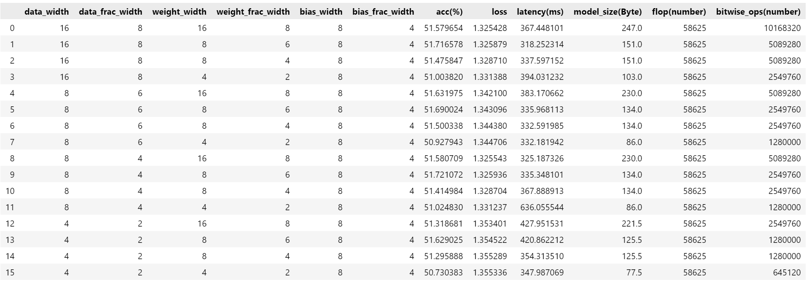
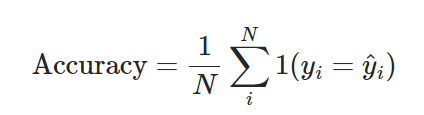
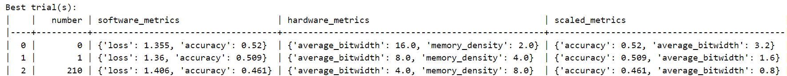

# Lab 3

## 1. Explore additional metrics that can serve as quality metrics for the search process. 

**Latency**: (Unit: ms, we have multiplied by 1000)

For each search option, we calculate the latency for each input-batch, then accumulate all latencies to take the average.
<pre>
for i, config in enumerate(search_spaces):
    mg, _ = quantize_transform_pass(mg, config)
    ''''''
    for inputs in data_module.train_dataloader():
        xs, ys = inputs
        start_time = time.time() # start time
        preds = mg.model(xs)
        end_time = time.time() # end time
        latency = end_time - start_time # latency
        latencies.append(latency*1000)
        ''''''
    latency_avg = sum(latencies) / len(latencies) 
</pre>

**Model size**: (Unit: Byte)

It is presupposed that the model, whose size is to be calculated, has already undergone quantization, each time with different search option.

For each search option, we calculate the total storage size of the model by iterating through the space occupied by the weights of each layer.
<pre>
The memory footprint of each layer is determined by the following attributes:
Linear: weight, bias
Batchnorm: weight(γ), bias(β), mean, variance
ReLU: None
</pre>

The subsequent script is designed for assessing the memory consumption attributed to the model
<pre>
def model_storage_size(model, weight_bit_width, bias_bit_width, data_bit_width):
    total_bits = 0 
    for name, param in model.named_parameters():
        if param.requires_grad and 'weight' in name:
            bits = param.numel() * weight_bit_width
            total_bits += bits
        elif param.requires_grad and 'bias' in name:
            bits = param.numel() * bias_bit_width
            total_bits += bits
    total_bits += data_bit_width*(1*16+1) # mean and variance of batchnorm
    total_bytes = total_bits / 8
    return total_bytes

for i, config in enumerate(search_spaces):
    # definition of weight & bias & data width
    size = model_storage_size(mg.model, weight_bit_width, bias_bit_width, data_bit_width)
    ''''''
</pre>

**Bit-wise operations**: (Unit: number)

For each search option, we compute the bitwise operations count for the linear module。

We employ the identical methodology as outlined in the optional task of Lab2.

<pre>
def bit_wise_op(model, input_res, data_width, weight_width, bias_width, batch_size):
    total_bitwise_ops = 0
    for name, module in model.named_modules():
        if isinstance(module, LinearInteger):
            bitwise_ops = calculate_bitwise_ops_for_linear(module, input_res, data_width, weight_width, bias_width, batch_size)
            total_bitwise_ops += bitwise_ops
    return total_bitwise_ops
def calculate_bitwise_ops_for_linear(module, input_res, data_bit_width, weight_bit_width, bias_bit_width, batch_size):
    in_features = module.in_features
    out_features = module.out_features
    bitwise_ops_per_multiplication = data_bit_width * weight_bit_width
    bitwise_ops_per_addition = data_bit_width * weight_bit_width
    bitwise_ops_per_output_feature = in_features * bitwise_ops_per_multiplication + (in_features - 1) * bitwise_ops_per_addition
    if module.bias is not None:
        bitwise_ops_per_output_feature += bias_bit_width
    total_bitwise_ops = out_features * bitwise_ops_per_output_feature
    return total_bitwise_ops*batch_size

for i, config in enumerate(search_spaces):
    # definition of weight & bias & data width
    bit_op = bit_wise_op(mg.model, (16,), data_bit_width, weight_bit_width, bias_bit_width)
    ''''''
</pre>

## 2. Implement some of these additional metrics and attempt to combine them with the accuracy or loss quality metric

Note that to leverage the pretrained model (as relying solely on randomly initialized parameters across various models during the search process would make metrics like accuracy become meaningless), it is imperative to preload the "best.ckpt" file.
<pre>
CHECKPOINT_PATH = "/mnt/d/imperial/second_term/adls/new/mase/mase_output/jsc-tiny_classification_jsc_2024-02-05/software/training_ckpts/best.ckpt"
# model definition
model = load_model(load_name=CHECKPOINT_PATH, load_type="pl", model=model)
</pre>

Subsequently, inference is performed for each configuration within the search space.
<pre>
# Essential Code Segment (Extraneous elements omitted)
for i, config in enumerate(search_spaces):
    size = model_storage_size(mg.model, weight_bit_width, bias_bit_width, data_bit_width)  # model size after it has been quantized
    bit_op = bit_wise_op(mg.model, (16,), weight_bit_width, bias_bit_width, data_bit_width, batch_size)

    acc_avg, loss_avg = 0, 0;  accs, losses, latencies = [], [], []

    for inputs in data_module.train_dataloader():
        xs, ys = inputs
        start_time = time.time()
        preds = mg.model(xs)
        end_time = time.time()
        latency = end_time - start_time
        latencies.append(latency)

        acc = metric(preds, ys); accs.append(acc)
        loss = torch.nn.functional.cross_entropy(preds, ys); losses.append(loss)

    acc_avg = sum(accs) / len(accs)
    loss_avg = sum(losses) / len(losses)
    latency_avg = sum(latencies) / len(latencies) 

    # for this particular element in search space
    recorded_metrics.append({
        ......
    })   
</pre>

The figure above depicts the distinct metrics observed for varying quantization configurations, from which we could derive two main conclusions:

(Remember for the original model without quantisation, the validation accuracy is 51.30%).

1）Evidently, Post-Training Quantization (PTQ) does not compromise validation accuracy while markedly diminishing the storage requirements for data, weights, and biases. Hence, quantization proves to be beneficial.

2) Generally speaking, as the quantization precision of data, weights, and biases increases (i.e., higher retained precision), the performance of the model improves, as can be shown by the increased accuracy and reduced loss (though not obvious in our case). However, this also impacts other metrics to a certain extent, such as a noticeable increase in the latency required to execute a single batch, an augmentation in model size, and a rise in the number of bitwise operations.

Accuracy and loss actually serve as the same quanlity metric. In fact, accuracy and loss are inversely proportional, implying that as the model's prediction accuracy increases, the prediction loss correspondingly decreases. This relationship is evident from the following formula for accuracy:

This formula quantifies the number of incorrect predictions within a batch. When we consider its negation, it also serves as a form of loss.

## 3. Implement the brute-force search as an additional search method within the system, this would be a new search strategy in MASE.

Currently, the system employs the TPE sampler from Optuna, which is a Bayesian optimization method.

Alternatively, the BruteForceSampler from Optuna can also be utilized for hyperparameter optimization.

<pre>
# optuna.py within search strategies
def sampler_map(self, name):
    ''''''
    case "brute-force":
        sampler = optuna.samplers.BruteForceSampler()
    return sampler
# jsc_toy_by_type.toml (actually this name should be changed to jsc_tiny_by_type.toml as it uses the JSC-Tiny model)
[search.strategy.setup]
''''''
sampler = "brute-force"
</pre>

Note that we also need to rewrite the new search space in .toml file.

Then we execute the command:
<pre>
!./ch search --config configs/examples/jsc_toy_by_type.toml --load /mnt/d/imperial/second_term/adls/new/mase/mase_output/jsc-tiny_classification_jsc_2024-02-05/software/training_ckpts/best.ckpt
</pre>

And we get:

